# Learn New
## HTML
* Extra Space removed by HTML
* New line spaces also ignored in HTML

* 1a
```html
<button>Click</button>
```
* 1bv
```html
<button>Arshath</button>
<button>Fried Rice</button>
```
* 1c
```html
<p>Hello, World!</p>
```
* 1d
```html
<p>Hello, World!</p>
<p>Today i attend my Zeroth review of my final year project</p>
```

* 1e
```html
<a href="https://www.google.co.in/">Search with Google</a>
```
* 1f
```html
<a href="https://www.google.co.in/" target="_blank">Search with Google</a>
```
* 1g
```html
<a href="https://www.amazon.in/">Back to Amazon</a>
<p>Nike Black Running Shoes</p>
<p>$39 - in stock.</p>
<p>Free delivery tomorrow.</p>
<button>Add to Cart</button>
<button>Buy now</button>
```
## CSS
* Project : https://www.supersimple.dev/exercises/buttons
* Solid Border is used to make the colour common for all the edges
* Adding Height and Width for the box is not a good choice , To get inside space use **padding**
* By default our web browser try to align our button based on text . So to get aware from this , use vertical-align : top;


```html
<style>
    .subscribe-button{
        background-color: rgb(216, 8, 8);
        height: 36px;
        color: white;
        cursor:pointer;
        width: 110px;
        border-style: none;
        border-radius: 2px;
        margin-right: 10px;
    }
    .join-button{
        background-color: white;
        height: 36px;
        width: 65px;
        border-color: rgb(53, 140, 216);
        border-style: solid;
        border-width: 1px;
        color: rgb(53, 140, 216);
        border-radius: 2px;
        cursor: pointer;
    }
    .tweet-button{
        background-color: rgb(2, 158, 247);
        color:white;
        border: none;
        height: 36px;
        border-radius: 18px;
        width: 74px;
        font-weight: bold;
        font-size: 15px;
        cursor: pointer;
        margin-left: 10px;
    }
</style>
<button class="subscribe-button">SUBSCRIBE</button>
<button class="join-button">JOIN</button>
<button class="tweet-button">Tweet</button>
```
### Exercise

* 2a
```html
<style>
    .uber-button{
        height: 38px;
        background-color: black;
        color:white;
        width: 120px;
        border-style: none;
        cursor: pointer;
    }
</style>
<button class="uber-button">Request now</button>
```
* 2b
```html
<style>
    .amazon-button{
        height: 34px;
        background-color: rgb(255,216,20);
        width: 180px;
        border-style: none;
        border-radius: 18px;
        cursor: pointer;
    }
</style>
<button class="amazon-button">Add to Cart</button>
```
* 2c
```html
<style>
    .github-button{
        height: 34px;
        background-color: rgb(46,164,79);
        width: 90px;
        border-style: none;
        color:white;
        font-weight: bold;
        border-radius: 5px;
        cursor: pointer;
    }
</style>
<button class="github-button">Sign up</button>
```
* 2d
```html
<style>
    button{
        cursor: pointer;
        height: 36px;
        width: 100px;
        font-weight: bold;
        cursor: pointer;
    }
    .bootstrap-button-1{
        background-color: rgb(121,82,179);
        color:white;
        border-radius: 2px;
        border: none;
        margin-right: 8px;
    }
    .bootstrap-button-2{
        color: rgb(108,117,125);
    }
</style>
<button class="bootstrap-button-1">Get started</button>
<button class="bootstrap-button-2">Download</button>
```
* 2e
```html
<style>
    button{
        height: 36px;
        font-weight: bold;
        cursor: pointer;
        border-radius: 18px;
    }
    .linkedin-button-1{
        background-color: rgb(10,102,194);
        color:white;
        margin-right: 8px;
        width: 230px;
        border:none;
    }
    .linkedin-button-2{
        color: rgb(10,102,194);
        border-color: rgb(10,102,194);
        border-style: solid;
        width: 80px;
    }
</style>
<button class="linkedin-button-1">Apply on company website</button>
<button class="linkedin-button-2">Save</button>
```

* 2f
```html
<style>
    a{
        color:rgb(0,113,133);
    }
    .title{
        font-size: 22px;
        font-weight: bold;
    }
    .price{
        color:rgb(0,118,0);
    }
    button{
        height: 30px;
        border-radius: 15px;
        border:none;
        width: 120px;
        cursor: pointer;
    }
    .cart-button{
        background-color: rgb(255,216,20);
    }
    .buy-button{
        background-color: rgb(255,164,28);
    }
</style>
<a href="https://www.amazon.in/">Back to Amazon</a>
<p class="title">Nike Black Running Shoes</p>
<p class="price">$39 - in stock.</p>
<p>Free delivery tomorrow.</p>
<button class="cart-button">Add to Cart</button>
<button class="buy-button">Buy now</button>
```
## Hover , Transition , Shadows
* Put the transiton in the class block (not hover) because it will do the transition for both activate and deactivate
* transition : css-property time;
* box-shadow : horizontal(right) vertical(bottom) blur color;
* ease : it creates a transition that starts slowly, speeds up in the middle, and then slows down again towards the end. This gives the transition a smooth and natural feel.
```html
<style>
    .subscribe-button{
        background-color: rgb(216, 8, 8);
        height: 36px;
        color: white;
        cursor:pointer;
        width: 110px;
        border-style: none;
        border-radius: 2px;
        margin-right: 10px;
        transition: opacity 0.15s;
    }
    .subscribe-button:hover{
        opacity:0.8;
    }
    .subscribe-button:active{
        opacity:0.4;
    }
    .join-button{
        background-color: white;
        height: 36px;
        width: 65px;
        border-color: rgb(53, 140, 216);
        border-style: solid;
        border-width: 1px;
        color: rgb(53, 140, 216);
        border-radius: 2px;
        cursor: pointer;
        transition: background-color 1s , color 1s;
    }
    .join-button:hover{
        background-color: rgb(53, 140, 216);
        color: white;
    }
    .join-button:active{
        opacity: 0.7;
    }
    .tweet-button{
        background-color: rgb(2, 158, 247);
        color:white;
        border: none;
        height: 36px;
        border-radius: 18px;
        width: 74px;
        font-weight: bold;
        font-size: 15px;
        cursor: pointer;
        margin-left: 10px;
    }
</style>
<button class="subscribe-button">SUBSCRIBE</button>
<button class="join-button">JOIN</button>
<button class="tweet-button">Tweet</button>
```
### Exercise
<video width="320" height="240" controls>
  <source src="./3-1.mp4" type="video/mp4">
</video>

* 3a
```html
<style>
    .uber-button{
        height: 38px;
        background-color: black;
        color:white;
        width: 120px;
        border-style: none;
        cursor: pointer;
    }
    .uber-button:hover{
        opacity: 0.7;
    }
</style>
<button class="uber-button">Request now</button>
```
* 3b
```html
<style>
    .amazon-button{
        height: 34px;
        background-color: rgb(255, 213, 0);
        width: 180px;
        border-style: none;
        border-radius: 18px;
        cursor: pointer;
        transition : background-color 0.15s;
    }
    .amazon-button:hover{
        background-color: rgb(246, 212, 41);
    }
</style>
<button class="amazon-button">Add to Cart</button>
```
* 3c
```html
<style>
    .github-button{
        height: 34px;
        background-color: rgb(46,164,79);
        width: 90px;
        border-style: none;
        color:white;
        font-weight: bold;
        border-radius: 5px;
        cursor: pointer;
        transition : box-shadow 0.5s;
    }
    .github-button:hover{
        box-shadow : 3px 3px 7px rgba(0,0,0,0.15);
    }
</style>
<button class="github-button">Sign up</button>
```
* 3d
```html
<style>
button{
    cursor: pointer;
    height: 36px;
    width: 100px;
    font-weight: bold;
    cursor: pointer;
}
.bootstrap-button-1{
    background-color: rgb(121,82,179);
    color:white;
    border-radius: 2px;
    border: none;
    margin-right: 8px;
    transition: background-color 0.15s;
}
.bootstrap-button-1:hover{
    background-color: rgb(91, 57, 141);
}
.bootstrap-button-2{
    color: rgb(108,117,125);
    transition: background-color 0.5s ease, color 0.5s ease;
}
.bootstrap-button-2:hover{
    background-color: rgb(108,117,125);
    color: #fff;
    border: none;
}
</style>
<button class="bootstrap-button-1">Get started</button>
<button class="bootstrap-button-2">Download</button>
```
* 3e
```html
<style>
    button{
        height: 36px;
        font-weight: bold;
        cursor: pointer;
        border-radius: 18px;
    }
    .linkedin-button-1{
        background-color: rgb(10,102,194);
        color:white;
        margin-right: 8px;
        width: 230px;
        border:none;
        transition: 0.15s background-color;
    }
    .linkedin-button-1:hover{
        background-color: rgb(20, 90, 159);
    }
    .linkedin-button-2{
        color: rgb(10,102,194);
        border-color: rgb(10,102,194);
        border-style: solid;
        border-width: 0.5px;
        width: 80px;
        background-color: #fff;
        transition : border-width 0.15s ease,background-color 0.15s;
    }
    .linkedin-button-2:hover{
        border-width: 1.6px;
        background-color: #F0F0F0;
    }
</style>
<button class="linkedin-button-1">Apply on company website</button>
<button class="linkedin-button-2">Save</button>
```
<video width="320" height="240" controls>
  <source src="./3-2.mp4" type="video/mp4">
</video>

* 3f
```html
<style>
    a{
        color:rgb(0,113,133);
        transition: color 0.015;
    }
    a:hover{
        color:red;
    }
    .title{
        font-size: 22px;
        font-weight: bold;
    }
    .price{
        color:rgb(0,118,0);
        font-weight: 600;
    }
    button{
        height: 30px;
        border-radius: 15px;
        border:none;
        width: 120px;
        cursor: pointer;
    }
    .cart-button{
        background-color: rgb(255,216,20);
    }
    .cart-button:hover{
        background-color: rgb(241, 211, 64);
    }
    .cart-button:active{
        opacity:0.4;
    }
    .buy-button{
        background-color: rgb(241, 159, 36);
    }
    .buy-button:hover{
        background-color: rgb(255, 154, 2);
    }
    .buy-button:active{
        opacity: 0.4;
    }
</style>
<a href="https://www.amazon.in/">Back to Amazon</a>
<p class="title">Nike Black Running Shoes</p>
<p class="price">$39 - in stock.</p>
<p>Free delivery tomorrow.</p>
<button class="cart-button">Add to Cart</button>
<button class="buy-button">Buy now</button>
```
## Chrome DevTools & CSS Box Model
### Exercise
<video width="320" height="240" controls>
  <source src="./4-1.mp4" type="video/mp4">
</video>

* 4a
```html
<style>
    .uber-button{
        background-color: black;
        color:white;
        padding:11px 21px;
        border-style: none;
        cursor: pointer;
    }
    .uber-button:hover{
        opacity: 0.7;
    }
</style>
<button class="uber-button">Request now</button>
```
* 4b
```html
<style>
    .amazon-button{
        background-color: rgb(255, 213, 0);
        border-style: none;
        border-radius: 18px;
        cursor: pointer;
        padding: 9px 57px;
        transition : background-color 0.15s;
    }
    .amazon-button:hover{
        background-color: rgb(246, 212, 41);
    }
</style>
<button class="amazon-button">Add to Cart</button>
```
* 4c
```html
<style>
    .github-button{
        background-color: rgb(46,164,79);
        border-style: none;
        color:white;
        font-weight: bold;
        padding:9px 21px;
        border-radius: 5px;
        cursor: pointer;
        transition : box-shadow 0.5s;
    }
    .github-button:hover{
        box-shadow : 3px 3px 7px rgba(0,0,0,0.15);
    }
</style>
<button class="github-button">Sign up</button><br>
```
* 4d
```html
<style>
button{
    cursor: pointer;
    font-weight: bold;
    cursor: pointer;
    padding: 10px 15px;
}
.bootstrap-button-1{
    background-color: rgb(121,82,179);
    color:white;
    border-radius: 2px;
    border-color: rgb(121,82,179);
    margin-right: 8px;
    transition: background-color 0.15s;
}
.bootstrap-button-1:hover{
    background-color: rgb(91, 57, 141);
}
.bootstrap-button-2{
    color: rgb(108,117,125);
    transition: background-color 0.5s ease, color 0.5s ease;
}
.bootstrap-button-2:hover{
    background-color: rgb(108,117,125);
    color: #fff;
    border: none;
}
</style>
<button class="bootstrap-button-1">Get started</button>
<button class="bootstrap-button-2">Download</button>
```
* 4e
```html
<style>
    button{
        padding:10px 10px;
        font-weight: bold;
        cursor: pointer;
        border-radius: 18px;
    }
    .linkedin-button-1{
        height: 36px;
        background-color: rgb(10,102,194);
        color:white;
        margin-right: 8px;
        width: 230px;
        border:none;
        transition: 0.15s background-color;
    }
    .linkedin-button-1:hover{
        background-color: rgb(20, 90, 159);
    }
    .linkedin-button-2{
        color: rgb(10,102,194);
        border-color: rgb(10,102,194);
        border-style: solid;
        border-width: 0.5px;
        width: 80px;
        background-color: #fff;
        transition : border-width 0.15s ease,background-color 0.15s;
    }
    .linkedin-button-2:hover{
        border-width: 1.6px;
        background-color: #F0F0F0;
    }
</style>
<button class="linkedin-button-1">Apply on company website</button> 
<button class="linkedin-button-2">Save</button>
```
* 4f,4g
```html
<style>
    .subscribe-button{
        background-color: #cc0000;
        height: 36px;
        color: white;
        cursor:pointer;
        width: 110px;
        border-style: none;
        border-radius: 2px;
        margin-right: 10px;
        transition: opacity 0.15s;
    }
    .subscribe-button:hover{
        opacity:0.8;
    }
    .subscribe-button:active{
        opacity:0.4;
    }
    .join-button{
        background-color: white;
        height: 36px;
        width: 65px;
        border-color: rgb(53, 140, 216);
        border-style: solid;
        border-width: 1px;
        color: rgb(53, 140, 216);
        border-radius: 2px;
        cursor: pointer;
        transition: background-color 1s , color 1s;
    }
    .join-button:hover{
        background-color: rgb(53, 140, 216);
        color: white;
    }
    .join-button:active{
        opacity: 0.7;
    }
    .tweet-button{
        background-color: rgb(2, 158, 247);
        color:white;
        border: none;
        padding:9px 16.5px;
        border-radius: 18px;
        font-weight: bold;
        font-size: 15px;
        cursor: pointer;
        margin-left: 10px;
    }
</style>
<button class="subscribe-button">SUBSCRIBE</button>
<button class="join-button">JOIN</button>
<button class="tweet-button">Tweet</button>
```
<video width="320" height="240" controls>
  <source src="./4-2.mp4" type="video/mp4">
</video>

* 4h
```html
<style>
    button{
        padding:5px;
        margin-left: 5px;
        margin-right: 5px;
        cursor:pointer;
    }
    a{
        margin-left: 5px;
        margin-right: 5px;
    }
</style>
<button>Back</button>
<a href="#">1</a>
<a href="#">2</a>
<a href="#">3</a>
<a href="#">4</a>
<a href="#">5</a>
<button>Next</button>
```
* 4i
```html
<style>
    button{
        padding:3px 10px;
        border: none;
        background-color: green;
        color: #fff;
        transition: padding 1.2s;
        cursor:pointer;
    }
    button:hover{
        padding:10px 30px;
    }
</style>
<button>Stretch</button>
```
* 4j
```html
<style>
    button{
        padding:5px 10px;
        border: none;
        background-color: green;
        color: #fff;
        box-shadow : 3px 3px 3px rgba(0,0,0,0.5);
        cursor:pointer;
    }
    button:active{
        margin-top: 3px;
        margin-left: 3px;
        box-shadow: none;
    }
</style>
<button>Shadow</button>
```
* 4k
```html
<style>
    button{
        padding:5px 10px;
        border: none;
        background-color: green;
        color: #fff;
        cursor:pointer;
        margin-left: 10px;
        margin-right: 10px;
        transition: padding 0.15s,margin 0.15s;
    }
    button:hover{
        padding-left:20px;
        padding-right: 20px;
        margin-left: 0px;
        margin-right: 0px;
    }
</style>
<button>One</button>
<button>Two</button>
<button>Three</button>
```
## Text Styles
* Default font family is - Times New Roman
* HTML entity - eg &copy
* <p> by default comes wiht the margin-top and margin-bottom
* html entity middle dot operator - &#183;
* html entity for checkmark - &#10003;
* html entity  greater than - &#62;
* html entity for coma - &#44;
* html entity for and - &#38;
* CSS specifity - The selector that is more specific have higher  (class name selector > element name selector)
* text element - It is a text inside the text element
* span is the most generic text element
* In HTML , Multiple space is considered as one space . So to get aware from this we use margin-left
### Exercise

* 5a
```html
<style>
    .topic{
        font-family: Tahoma;
        font-weight: bold;
        font-size: 40px;
    }
</style>
<p class="topic">This is Tahoma Font</p>
```
* 5b
```html
<style>
    p{
        font-family: Arial;
        margin-top: 0px;
        margin-bottom: 0px;
    }
    .topic{
        font-family: Tahoma;
        font-weight: bold;
        font-size: 40px;
        margin-bottom: 5px;
    }
    .deadline{
        font-style: italic;
        color: rgba(234, 6, 6, 0.744);
        font-size: 22px;
    }
</style>
<p class="topic">Biggest Deals of the Year!</p>
<p class="deadline">Sales end Tuesday</p>
```
* 5c
```html
<style>
    *{
        font-family: Verdana;
        font-size: 14px;
    }
    p{
        margin-top: 0px;
        margin-bottom: 0px;
    }
    .title{
        font-weight: bold;
    }
    .sub-title{
        color:#606060;
        margin-bottom: 20px;
    }
    .description{
        width: 250px;
        margin-bottom: 20px;
    }
    button{
        padding:5px 10px;
        background-color: green;
        color:#fff;
        border:none;
    }
</style>
<p class="title">HTML CSS Course</p>
<p class="sub-title">Beginner to Pro</p>
<p class="description">
    In this course,we'll learn the skills you need to become a developer.
</p>
<button>Get Started</button>
```
* 5d
```html
<style>
    p{
        font-family: Arial;
        font-size: 16px;
        text-align: center;
    }
    .question{
        font-weight: bold;
        font-size: 28px;
    }
    .read-more{
        color: rgb(67, 129, 236);
    }
</style>
<p class="question">Shopping for your business?</p>
<p class="work">See how Apple at Work can help.</p>
<p class="read-more">Learn more &#62;</p>
```

* 5e
```html
<style>
    p{
        margin-top: 0px;
        margin-bottom: 0px;
        font-family: Arial;
        text-align: center;
    }
    .new{
        color:#b70404;
    }
    .title{
        font-weight: bold;
        margin-top: 10px;
        margin-bottom: 10px;
        font-size: 20px;
    }
    .sub-title{
        font-weight: bold;
        font-size: 30px;
    }
    .price{
        color:#606060;
        margin-top: 10px;
        margin-bottom: 15px;
    }
    .buy {
        background-color: rgb(0, 113, 227);
        color: white;
        padding-top: 7px;
        padding-bottom: 7px;
        padding-left: 15px;
        padding-right: 15px;
        border-radius: 30px;
        font-weight: bold;
        cursor: pointer;
    }
</style>
<p class="new">New</p>
<p class="title">MacBook Pro</p>
<p class="sub-title">Supercharged for pros.</p>
<p class="price">From &#36; 1999</p>
<p>
  <span class="buy">Buy</span>
</p>
```
* 5f
```html
<style>
    p{
        margin-top: 0px;
        margin-bottom: 0px;
        font-family: Arial;
        font-size: 14px;
    }
    .price{
        font-size: 30px;
    }
    .currency{
        font-size: 14px;
        color:#606060;
    }
    .profit{
        color:green;
        margin-top: 8px;
        margin-bottom: 8px;
    }
    .loss{
        color: rgb(100, 100, 100);
    }
    .decrease{
        color:rgb(119, 11, 11);
    }
</style>
<p class="price">1&#44;049.61 <span class="currency">USD</span></p>
<p class="profit">&#43;18.05 (1.75&#37;) today</p>
<p class="loss">After hours 1&#44;048.00 <span class="decrease">-1.61(0.15&#37;)</span></p>
```
* 5g
```html
<style>
    p{
        margin-top: 0px;
        margin-bottom: 0px;
        font-family: Arial;
        font-size: 14px;
    }
    .author{
        font-weight: bold;
    }
    .company{
        color:#606060;
    }
    .description{
        margin-bottom: 15px;
        width: 450px;
    }
    .user{
        color:dodgerblue;
    }
    
</style>
<p class="title"><span class="author">freeCodeCamp.org</span> <span class="company">&#64;freeCodeCamp 1h</span></p>
<p class="description">As a web developer, you'll want to make your projects easy to use and navigate around.</p>
<p class="tips">Here <span class="user">&#64;chp_it</span> outlines the top skills new developers should have.</p>
```
## HTML Structure
* void elements - It doesn't need a closing tag
```html
<!DOCTYPE html>
<html>
    <head></head>
    <body></body>
</html>
```

* 6d
```html
<!DOCTYPE html>
<html>
    <head>
        <title>Order</title>
        <link rel="stylesheet" href="./css/6d.css">
        <link rel="preconnect" href="https://fonts.googleapis.com">
        <link rel="preconnect" href="https://fonts.gstatic.com" crossorigin>
        <link href="https://fonts.googleapis.com/css2?family=Montserrat:ital,wght@0,100..900;1,100..900&display=swap" rel="stylesheet">
    </head>
    <body>
        <p class="title">Model 3</p>
        <p class="order">Order Online for <span class="delivery">Touchless Delivery</span></p>
    </body>
</html>
```
```css
p{
    margin-top: 0px;
    margin-bottom: 0px;
    text-align: center;
    font-family: Montserrat;
}
.title{
    font-weight: bold;
    font-size: 30px;
    margin-bottom: 15px;
}
.order{
    font-size: 18px;
    color:#606060;
}
.delivery{
    text-decoration: underline;
    cursor: pointer;
}
```
## Images and Text Boxes (here after the assignment will be in the folder)

### Exercises

* 7a
```html
<style>
    .image{
        width: 200px;
        border-radius: 10px;
    }
</style>

```
* 7b
```html
<style>
    .image{
        width: 200px;
        height: 200px;
        object-fit: cover;
        object-position: center;
    }
</style>

```
* 7c
```html
<style>
    .image{
        width: 200px;
        height: 200px;
        object-fit: cover;
        object-position: center;
        border-radius: 50%;
    }
</style>

```

* 7d
```html
<style>
    .input-box{
        font-size: 16px;
        border-width: 1px;
        border-style: solid;
        border-color: rgb(200, 200, 200);
        padding-top: 12px;
        padding-bottom: 12px;
        padding-left: 15px;
        padding-right: 15px;
        border-radius: 8px;
    }
</style>
<input type="text" class="input-box" placeholder="Search">
```
* 7e
```html
<style>
    .input-box{
        font-size: 16px;
        border:none;
        padding-top: 12px;
        padding-bottom: 12px;
        padding-left: 15px;
        padding-right: 15px;
        border-radius: 30px;
        width: 500px;
        box-shadow: 0px 1px 5px rgba(0, 0, 0, 0.25);
    }
</style>
<input type="text" class="input-box" placeholder="Search Google or type a URL">
```
* 7f
```html
<style>
    p,.agree{
        font-family: Arial;
    }
    p{
        color:#606060;
        font-size: 14px;
        margin-top: 0px;
        margin-bottom: 0px;
    }
    .search-box{
        border-radius: 3px;
        margin-top: 5px;
        margin-bottom: 10px;
        width: 350px;
        padding: 8px;
        border-width: 2px;
        border-style: solid;
        border-color: rgb(100, 100, 100);
    }
    .agree{
        margin-bottom: 5px;
    }
    .join-button{
        width: 350px;
        color:#fff;
        background-color: rgb(14, 103, 246);
        border:none;
        padding:10px 30px;
        border-radius: 20px;
    }
</style>
<p class="label">Email</p>
<input type="text" class="search-box">
<p class="agree">By clicking Agree &#38; Join, you agree to the Privacy Policy</p>
<button class="join-button">Agree &#38; Join</button>
```
* 7g
```html
<style>
    .cat-image{
        border-radius: 50%;
        width: 50px;
        height: 50px;
        object-fit: cover;
        object-position: center;
        vertical-align: middle;
    }
    .word{
        border: none;
        padding: 5px 40px 0px 5px;
    }
    button{
        color: #fff;
        font-weight: bold;
        padding: 5px 15px;
        border: none;
        border-radius: 20px;
        background-color: rgb(39, 98, 246);
    }
</style>

<input class="word" placeholder="What's happening?">
<button>Tweet</button>
```
## CSS Display property
* In HTML there are three types of elements
1. Block element - Takes the entire line eg.p
1. Inline-Block element - Onnly takes as much as space needed eg.input
1. Inline element - Appear within a line of text eg.span , strong
* To switch block to inline-block - display:inline-block
* Inline block to block - display:block

* 8a
```html
<style>
    input{
        display: block;
        margin-bottom: 5px;
    }
</style>
<input type="text" placeholder="Name">
<input type="text" placeholder="Email">
```
* 8b
```html
<style>
    p,button{
        font-family: Arial;
    }
    .more{
        display: inline-block;
        width: 210px;
        vertical-align: middle;
    }
</style>
<p class="more">Thanks for chatting with our customer support. Would you like to take our quick survey?</p>
<button>Yes</button>
<button>No</button>
```
* 8c
```html
<style>
    .input-box{
        display: block;
        font-size: 16px;
        border:none;
        padding-top: 12px;
        padding-bottom: 12px;
        padding-left: 15px;
        padding-right: 15px;
        border-radius: 30px;
        width: 500px;
        box-shadow: 0px 1px 5px rgba(0, 0, 0, 0.25);
    }
    .google{
        width: 300px;
        margin-left: 100px;
        margin-bottom: 20px;
    }
</style>

<input type="text" class="input-box" placeholder="Search Google or type a URL">
```
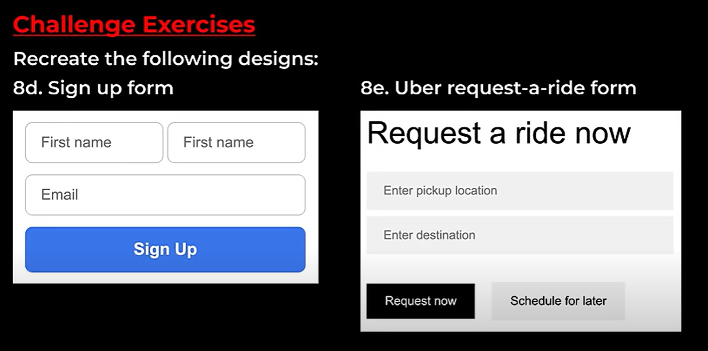
* 8d
```html
<style>
    input{
        padding:5px;
        border:none;
        box-shadow: 0px 1px 5px rgba(0, 0, 0, 0.25);
        border-radius: 5px;
    }
    .fname,.lname{
        width: 98.5px;
    }
    .email{
        display: block;
        width: 200px;
        margin-top: 10px;
        margin-bottom: 10px;
    }
    .sign-up{
        width: 200;
        background-color: dodgerblue;
        font-weight: bold;
        border:none;
        padding-top:8px;
        padding-bottom: 8px;
        color:#fff;
        border-radius: 5px;
    }
</style>
<input type="text" class="fname" placeholder="First name">
<input type="text" class="lname" placeholder="Last name">
<input type="text" class="email" placeholder="Email">
<button class="sign-up">Sign Up</button>
```
* 8e
```html
<style>
    *{
        font-family: Arial;
    }
    .source,.destination{
        display: block;
    }
    .request{
        font-size: 28px;
        margin-bottom: 20px;
    }
    input{
        border: none;
        box-shadow: 0px 1px 5px rgba(0,0,0,0.25);
        padding:10px 100px 10px 10px;
    }
    .source{
        margin-bottom: 5px;
    }
    .destination{
        margin-bottom: 20px;
    }
    button{
        padding:10px 10px;
        border: none;
    }
    .request-button{
        background-color: black;
        color: #fff;
        margin-right: 10px;
    }
    .later-button{
        color:#000;
    }
</style>
<p class="request">Request a ride now</p>
<input type="text" class="source" placeholder="Enter pickup location">
<input type="text" class="destination" placeholder="Enter destination">
<button class="request-button">Request now</button>
<button class="later-button">Schedule for later</button>
```
## Div element
* div means division
* block - Take up the entire linne int the **container**

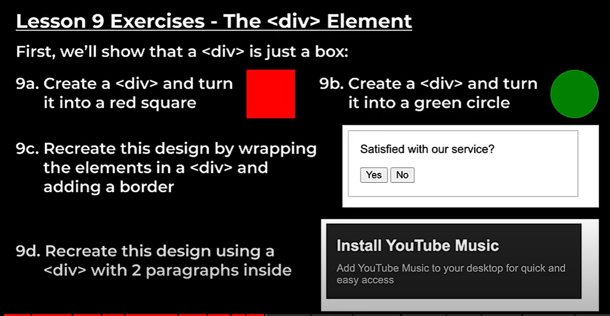
* 9a
```html
<style>
    .box{
        width: 100px;
        height: 100px;
        background-color: red;
    }
</style>
<div class="box"></div>
```
* 9b
```html
<style>
    .circle{
        width: 100px;
        height: 100px;
        background-color: green;
        border-radius: 50%;
    }
</style>
<div class="circle"></div>
```
* 9c
```html
<style>
    *{
        font-family : Arial;
    }
    .container{
        padding : 15px;
        border-style:solid;
        border-width:1px;
        width: 300px;
    }
    .agree{
        margin-top: 0px;
        margin-bottom: 10px;
    }
</style>
<div class="container">
    <p class="agree">Satisfied with our service?</p>
    <button>Yes</button>
    <button>No</button>
</div>
```
* 9d
```html
<style>
    .container{
        font-family : Arial;
        padding : 15px;
        background-color: grey;
        width: 360px;
        color: #fff;
    }
    .title{
        margin-top: 0px;
        margin-bottom: 5px;
        font-size: 25px;
        font-weight: bold;
    }
    .description{
        color: rgb(160, 160, 160);
    }
</style>
<div class="container">
    <p class="title">Install YouTube Music</p>
    <p class="description">Add YouTube Music to your desktop for quick and easy access</p>
</div>
```
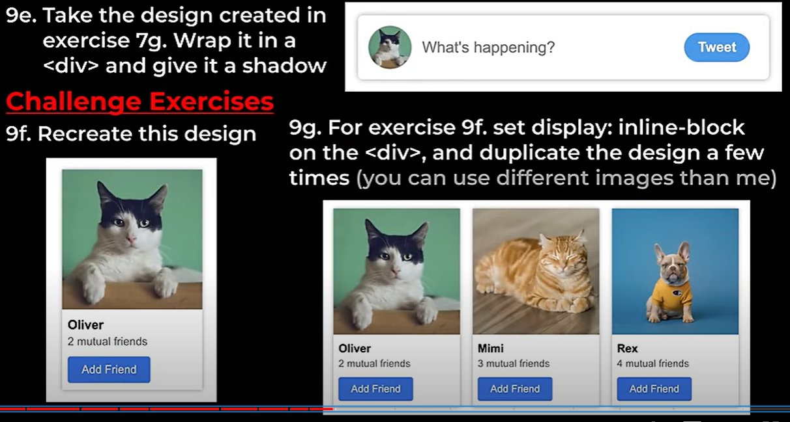
* 9e
```html
<style>
    .container{
        padding:10px;
        width: 345px;
        box-shadow: 0px 1px 5px rgba(0,0,0,0.25);
        border-radius: 4px;
    }
    .cat-image{
        border-radius: 50%;
        width: 50px;
        height: 50px;
        object-fit: cover;
        object-position: center;
        vertical-align: middle;
    }
    .word{
        border: none;
        padding: 5px 40px 0px 5px;
    }
    button{
        color: #fff;
        font-weight: bold;
        padding: 5px 15px;
        border: none;
        border-radius: 20px;
        background-color: rgb(39, 98, 246);
    }
</style>
<div class="container">
    
    <input class="word" placeholder="What's happening?">
    <button>Tweet</button>
</div>
```
* 9f
```html
<style>
    p{
        font-family: Arial;
        margin-top: 0px;
        margin-bottom: 0px;
        
    }
    .container{
        width: 150px;
        box-shadow: 0px 1px 5px rgba(0,0,0,0.3);
    }
    .cat-image{
        width: 150px;
    }
    .user-name{
        margin-top: 10px;
        margin-bottom: 5px;
        font-weight: bold;
        font-size: 14px;
    }
    .user-name,.mutual,button{
        margin-left: 8px;
    }
    .mutual{
        font-size: 10px;
    }
    button{
        margin-top: 10px;
        margin-bottom: 8px;
        padding:5px 15px;
        border: none;
        color:#fff;
        background-color: rgb(17, 110, 250);
        border-radius: 2px;
        font-size: 10px;
    }
</style>
<div class="container">
    
    <p class="user-name">Oliver</p>
    <p class="mutual">2 mutual friends</p>
    <button>Add Friend</button>
</div>
```
* 9g
```html
<style>
    p{
        font-family: Arial;
        margin-top: 0px;
        margin-bottom: 0px;
        
    }
    .container{
        width: 150px;
        box-shadow: 0px 1px 5px rgba(0,0,0,0.3);
        display: inline-block;
        margin-right: 10px;
    }
    .cat-image{
        width: 150px;
    }
    .user-name{
        margin-top: 10px;
        margin-bottom: 5px;
        font-weight: bold;
        font-size: 14px;
    }
    .user-name,.mutual,button{
        margin-left: 8px;
    }
    .mutual{
        font-size: 10px;
    }
    button{
        margin-top: 10px;
        margin-bottom: 8px;
        padding:5px 15px;
        border: none;
        color:#fff;
        background-color: rgb(17, 110, 250);
        border-radius: 2px;
        font-size: 10px;
    }
</style>
<div class="container">
    
    <p class="user-name">Oliver</p>
    <p class="mutual">2 mutual friends</p>
    <button>Add Friend</button>
</div>
<div class="container">
    
    <p class="user-name">Mimi</p>
    <p class="mutual">3 mutual friends</p>
    <button>Add Friend</button>
</div>
<div class="container">
    
    <p class="user-name">Rex</p>
    <p class="mutual">4 mutual friends</p>
    <button>Add Friend</button>
</div>
```
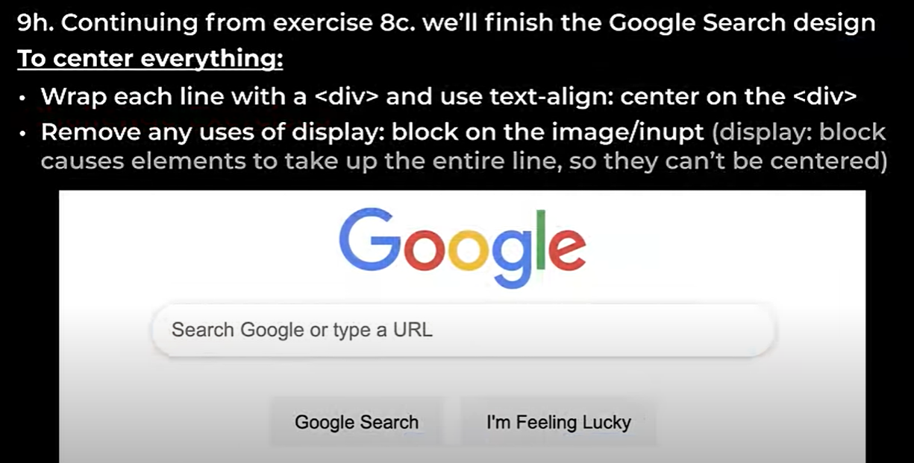
* 9h
```html
<style>
    div{
        text-align: center;
    }
    .input-box{
        font-size: 16px;
        border:none;
        padding-top: 12px;
        padding-bottom: 12px;
        padding-left: 15px;
        padding-right: 15px;
        border-radius: 30px;
        width: 500px;
        box-shadow: 0px 1px 5px rgba(0, 0, 0, 0.25);
        margin-bottom: 20px;
    }
    .google{
        width: 300px;
        margin-bottom: 20px;
    }
    button{
        padding:10px;
        border:none;
        margin-right: 10px;
    }
</style>
<div>
    
</div>
<div>
    <input type="text" class="input-box" placeholder="Search Google or type a URL">
</div>
<div>
    <button class="search-button">Google Search</button>
    <button class="lucky-button">I'm Feeling Lucky</button>
</div>
```

## Nested Layout Technique
* Link : https://www.supersimple.dev/css/nested-layouts-technique
* There are two types of layout
    * Vertical layout
    * Horizontal layout

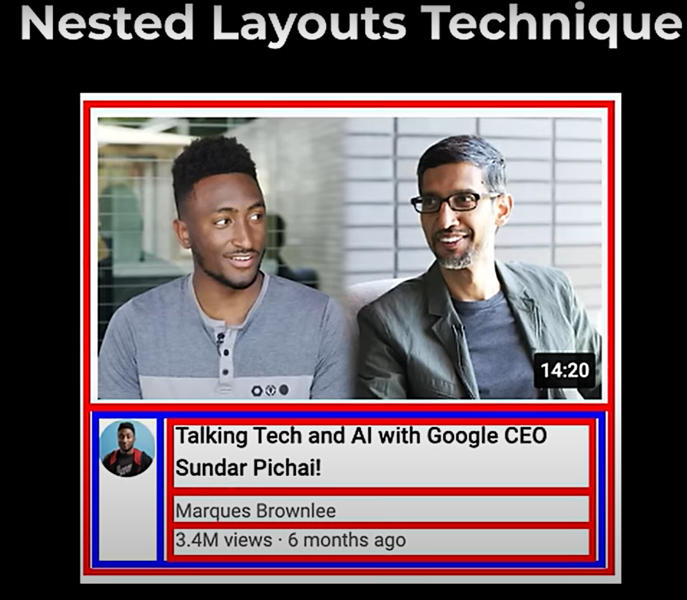

* Here red is Vertical layout and Blue is Horizontal layout

### Exercise
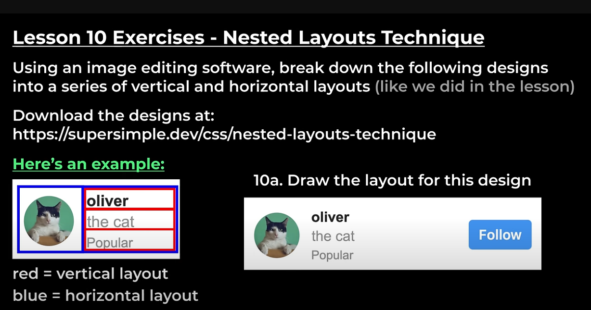
* 10a
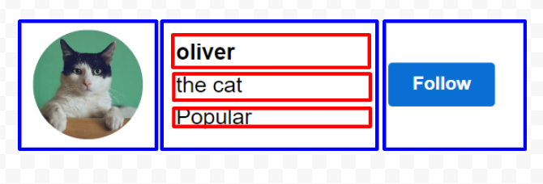
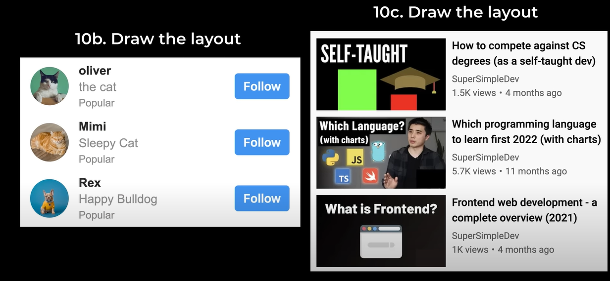
* 10b
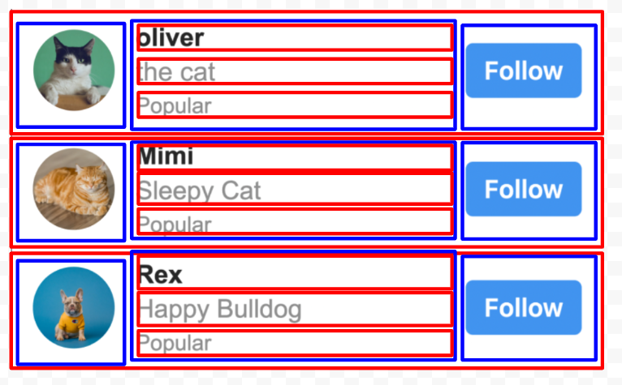
* 10c
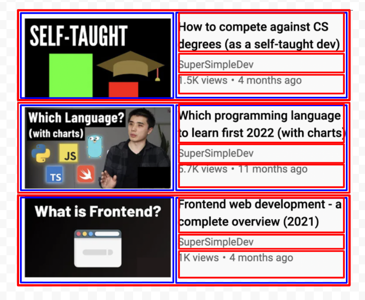
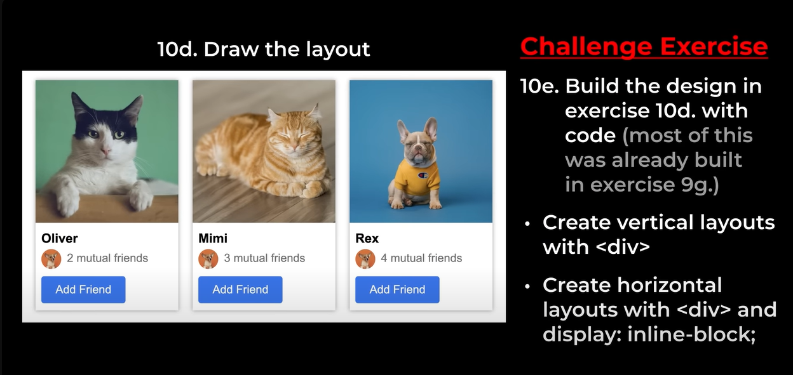
* 10d
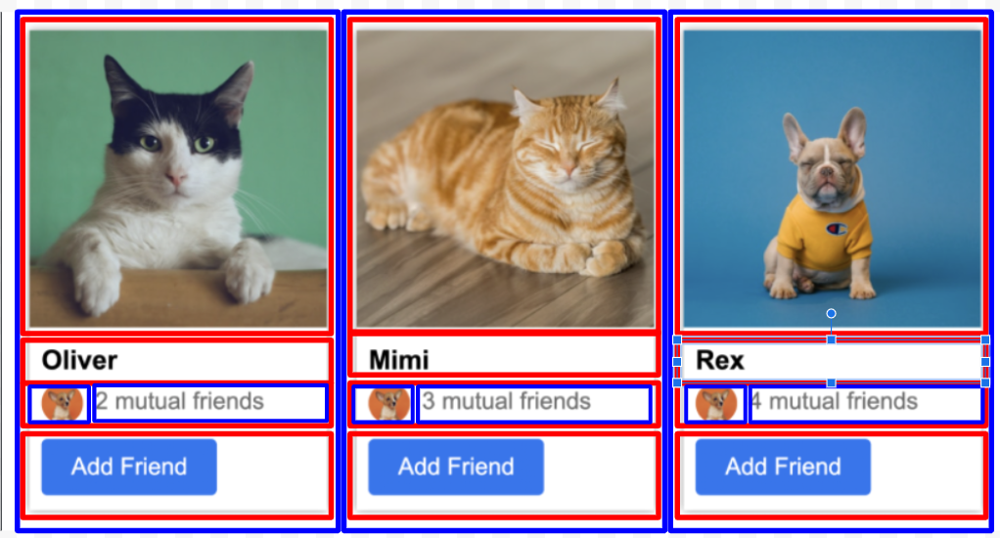
* 10e
```html
<style>
    p{
        font-family: Arial;
        margin-top: 0px;
        margin-bottom: 0px;
        
    }
    .horizontal-outer{
        width: 150px;
        box-shadow: 0px 1px 5px rgba(0,0,0,0.3);
        display: inline-block;
        margin-right: 10px;
    }
    .cat-image{
        width: 150px;
        height: 100.8px;
    }
    .user-name{
        margin-top: 10px;
        margin-bottom: 5px;
        font-weight: bold;
        font-size: 14px;
    }
    .user-name,button{
        margin-left: 8px;
    }
    .mutual{
        font-size: 12px;
        color:#606060;
    }
    .vertical2{
        width: 150px;
    }
    .hori1,.hori2{
        display: inline-block;
    }
    
    .icon{
        width: 20px;
        height: 20px;
        object-fit: cover;
        border-radius: 50%;
        margin-left: 8px;
        vertical-align: middle;
    }
    button{
        margin-top: 10px;
        margin-bottom: 8px;
        padding:5px 15px;
        border: none;
        color:#fff;
        background-color: rgb(17, 110, 250);
        border-radius: 2px;
        font-size: 10px;
    }
</style>
<div class="horizontal-outer">
    <div class="vertical">
        
    </div>
    <div class="vertical1">
        <p class="user-name">Oliver</p>
    </div>
    <div class="vertical2">
        <div class="hori1">
            
        </div>
        <div class="hori2">
            <p class="mutual">2 mutual friends</p>
        </div>
    </div>
    <div class="vertical3">
        <button>Add Friend</button>
    </div>
</div>
<div class="horizontal-outer">
    <div class="vertical">
        
    </div>
    <div class="vertical1">
        <p class="user-name">Mimi</p>
    </div>
    <div class="vertical2">
        <div class="hori1">
            
        </div>
        <div class="hori2">
            <p class="mutual">3 mutual friends</p>
        </div>
    </div>
    <div class="vertical3">
        <button>Add Friend</button>
    </div>
</div>
<div class="horizontal-outer">
    <div class="vertical">
        
    </div>
    <div class="vertical1">
        <p class="user-name">Rex</p>
    </div>
    <div class="vertical2">
        <div class="hori1">
            
        </div>
        <div class="hori2">
            <p class="mutual">4 mutual friends</p>
        </div>
    </div>
    <div class="vertical3">
        <button>Add Friend</button>
    </div>
</div>
```
## Grid
* A Grid is a layout that has a rows and columns
* It makes the alignment much better
* In normal alignment it will take extra space for the new line div(1 space) so playing with width is a difficult task
* fr = free space
* 1fr according to  the window size it will take the remaining space(we are gonnna use in final project)
* grid-template-column is the best for **horizontal layout**
* This is the replacement of inline-block, vertical-position , margin-right-left
* To align items vertically we use - align-items: center;
### Exercise
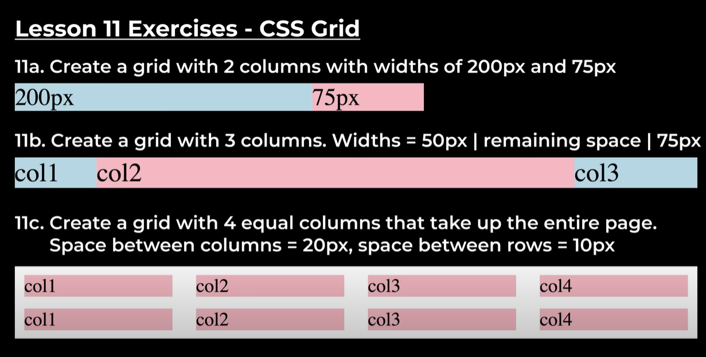
* 11a
```html
<div class="container" style="
    display:grid;grid-template-columns:200px 75px;
">
    <div style="background-color:lightblue">200px</div>
    <div style="background-color:lightpink">75px</div>
</div>
```
* 11b
```html
<div class="container" style="
    display:grid;grid-template-columns:50px 1fr 75px;
">
    <div style="background-color:lightblue">col1</div>
    <div style="background-color:lightpink">col2</div>
    <div style="background-color:lightblue">col3</div>
</div>
```
* 11c
```html
<div class="container" style="
    display:grid;grid-template-columns:1fr 1fr 1fr 1fr;
    row-gap:10px;
    column-gap:20px;
">
    <div style="background-color:lightpink">col1</div>
    <div style="background-color:lightpink">col2</div>
    <div style="background-color:lightpink">col3</div>
    <div style="background-color:lightpink">col4</div>
    <div style="background-color:lightpink">col1</div>
    <div style="background-color:lightpink">col2</div>
    <div style="background-color:lightpink">col3</div>
    <div style="background-color:lightpink">col4</div>
</div>
```

* 11d
```html
<style>
    p{
        font-family: Arial;
        margin-top: 0px;
        margin-bottom: 0px;
        
    }
    .box{
        display: grid;
        grid-template-columns: 150px 150px 150px;
        column-gap: 15px;
    }
    .horizontal-outer{
        width: 150px;
        box-shadow: 0px 1px 5px rgba(0,0,0,0.3);
    }
    .cat-image{
        width: 100%;
        height: 100.8px;
    }
    .user-name{
        margin-top: 10px;
        margin-bottom: 5px;
        font-weight: bold;
        font-size: 14px;
    }
    .user-name,button{
        margin-left: 8px;
    }
    .mutual{
        font-size: 12px;
        color:#606060;
    }
    .vertical2{
        width: 150px;
        display: grid;
        grid-template-columns: 30px 1fr;
        align-items: center;
        column-gap: 5px;
    }
    .icon{
        width: 20px;
        height: 20px;
        object-fit: cover;
        border-radius: 50%;
        margin-left: 8px;
        vertical-align: middle;
    }
    button{
        margin-top: 10px;
        margin-bottom: 8px;
        padding:5px 15px;
        border: none;
        color:#fff;
        background-color: rgb(17, 110, 250);
        border-radius: 2px;
        font-size: 10px;
    }
</style>
<div class="box">
    <div class="horizontal-outer">
        <div class="vertical">
            
        </div>
        <div class="vertical1">
            <p class="user-name">Oliver</p>
        </div>
        <div class="vertical2">
            <div class="hori1">
                
            </div>
            <div class="hori2">
                <p class="mutual">2 mutual friends</p>
            </div>
        </div>
        <div class="vertical3">
            <button>Add Friend</button>
        </div>
    </div>
    <div class="horizontal-outer">
        <div class="vertical">
            
        </div>
        <div class="vertical1">
            <p class="user-name">Mimi</p>
        </div>
        <div class="vertical2">
            <div class="hori1">
                
            </div>
            <div class="hori2">
                <p class="mutual">3 mutual friends</p>
            </div>
        </div>
        <div class="vertical3">
            <button>Add Friend</button>
        </div>
    </div>
    <div class="horizontal-outer">
        <div class="vertical">
            
        </div>
        <div class="vertical1">
            <p class="user-name">Rex</p>
        </div>
        <div class="vertical2">
            <div class="hori1">
                
            </div>
            <div class="hori2">
                <p class="mutual">4 mutual friends</p>
            </div>
        </div>
        <div class="vertical3">
            <button>Add Friend</button>
        </div>
    </div>
</div>
```
## Flexbox
* Is is like grid , but it is more flexible
* flex:1 - is like the 1fr
* grid is rigid layout(width is based on the position)
* flex is flexible layout (carrying the width)
* When we use flexbox - In youtube top right we have 4 element but when we sign out there will be only  3 element os 1fr 1fr 1fr 1fr is an issue , So there flexbox is best (flexible)
* justify-content : start(default) , place the element **horizontly**
* align-items : stretch(default) , place the element **vertically**